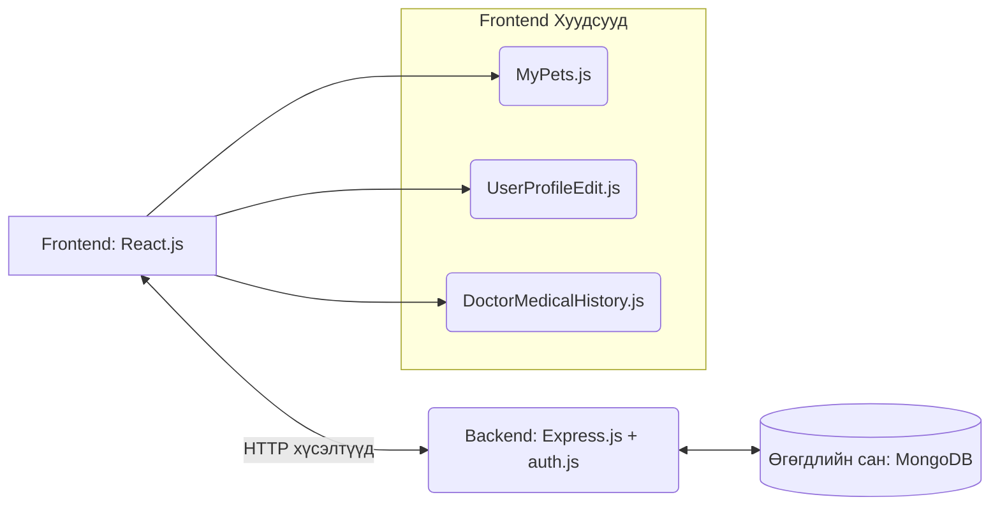

# Амьтны Эмнэлгийн Системийн Кодын Тайлбар

Энэхүү баримт бичигт таны нээлттэй байгаа 5 файлын үүрэг зориулалт болон хэрхэн ажилладаг талаарх дэлгэрэнгүй тайлбарыг зургийн хамт (бүдүүвч зураг болон жишээ зураг) орууллаа. Энэхүү файлыг та шууд хуулж аваад Microsoft Word дээр буулгаж (Paste) ашиглах боломжтой.

---

## 🏗 Ерөнхий Архитектур (Бүдүүвч зураг)

React (Frontend) болон Express.js (Backend) хоорондоо хэрхэн харилцаж байгааг доорх зураг харуулж байна.

*(Мэдээлэл аюулгүй байдлаар дамжих бөгөөд нууц үг шифрлэгдэн хадгалагддаг.)*

---

## 1. `frontend/src/pages/MyPets.js` - Миний амьтад хуудас

**Үүрэг:** Хэрэглэгч системд нэвтэрсний дараа өөрийн бүртгүүлсэн амьтдын мэдээлэл болон тэдний дараагийн үзлэгийн цагийг харах зориулалттай хуудас.

**Хэрхэн ажилладаг вэ?**
- Хэрвээ хэрэглэгч нэвтрээгүй бол "Та системд нэвтрээгүй байна" гэсэн анхааруулга гарна.
- **`fetchPets`**: Хэрэглэгчийн ID-г ашиглан backend-ээс тухайн хэрэглэгчийн амьтдын мэдээллийг татаж авдаг.
- **`fetchAppointments`**: Тухайн амьтны эмчид үзүүлэхээр захиалсан ирээдүйн цагуудыг татаж авдаг.
- Түүнчлэн шинээр амьтан нэмэх `PetForm` компонентийг агуулсан бөгөөд амьтан амжилттай нэмэгдмэгц жагсаалтыг шууд шинэчилнэ (`handlePetAdded`).

**Харагдах байдал (Жишээ зураг):**

*(Хэрэглэгчийн амьтдыг карт хэлбэрээр ингэж харуулдаг)*

---

## 2. `backend/controllers/auth.js` - Хэрэглэгчийн бүртгэл, нэвтрэх хэсгийн удирдлага

**Үүрэг:** Backend талд хэрэглэгчийн мэдээллийг боловсруулах, баталгаажуулах, мөн админы статистик мэдээлэл гаргах логикуудыг агуулдаг.

**Гол функцүүд:**
- **`register` (Бүртгүүлэх):** Хэрэглэгчээс ирсэн имэйл бүртгэлтэй эсэхийг шалгаад, нууц үгийг `bcrypt` ашиглан шифрлэж (Hash) аюулгүйгээр хадгалдаг.
- **`login` (Нэвтрэх):** Имэйл болон нууц үг зөв эсэхийг шалгана. Google эрхээр бүртгүүлсэн хүмүүст нууц үгээр нэвтрэхийг хаах тохируулга хийгдсэн байна.
- **`updateUser`, `deleteUser`**: Хэрэглэгчийн мэдээлэл шинэчлэх, устгах.
- **`getAdminStats`**: Админы хянах самбарт зориулж нийт хэрэглэгч, эмч, амьтад, үзлэгийн түүх зэргийн тоог баазаас тоолж (countDocuments) буцаадаг.

---

## 3. `backend/Routes/auth.js` - Хэрэглэгчийн замууд (Routes)

**Үүрэг:** Frontend-ээс ирэх хүсэлтүүд (URL)-ийг `auth.js` controller-ын аль функц рүү чиглүүлэхийг тодорхойлдог чиглүүлэгч.

**Тохиргоонууд:**
- `POST /register` -> `register` функц ажиллана.
- `POST /login` -> `login` функц ажиллана.
- `GET /admin/stats` -> Админы статистик мэдээллийг татна гэх мэт хялбар ойлгомжтойгоор замыг зааж өгсөн файлууд юм.

---

## 4. `frontend/src/components/UserProfileEdit.js` - Хувийн мэдээлэл засах хэсэг

**Үүрэг:** Хэрэглэгч өөрийн овог нэр, утасны дугаар, имэйл болон нууц үгээ өөрчлөх боломжтой форм (дотоод компонент).

**Хэрхэн ажилладаг вэ?**
- Эхлээд `useState` дээр хуучин мэдээллүүдээ харуулна.
- Хэрэглэгч шинэ нууц үг оруулаагүй тохиолдолд нууц үгийг засахгүйгээр алгасдаг логик (`delete updateData.password;`).
- `PUT` хүсэлтээр API-руу мэдээллийг явуулж, амжилттай болсон тохиолдолд `localStorage`-д хадгалагдсан хэрэглэгчийн мэдээллийг давхар шинэчилнэ (хуудас refresh хийхгүйгээр шууд өөрчлөгдөнө).

---

## 5. `frontend/src/components/DoctorMedicalHistory.js` - Эмчийн үзлэгийн түүх

**Үүрэг:** Эмч өөрийн үзлэг хийсэн амьтдын түүхийг харах, хайлт хийх, цаашлаад дараагийн үзлэгийн цагийг товлох боломжтой удирдлагын хэсэг.

**Хэрхэн ажилладаг вэ?**
- **Хайлт хийх:** `handleSearch` функц нь үзлэгийн түүх дотроос эзний имэйл эсвэл утасны дугаараар шууд(тэр дор нь) хайлт хийж шүүлтүүрдэнэ.
- **Цаг товлох:** Амьтанд "Дараагийн үзлэг товлох" товч дарснаар дэлгэцэн дээр Modal (попап цонх) гарч ирэх бөгөөд огноо, цаг сонгох боломжтой.
- **`handleScheduleNextAppt`**: Эмчийн шинээр өгсөн цагийг эхлээд Эмчийн цагийн хуваарь (Schedule) руу хадгалаад, дараа нь Захиалга (Appointment) руу бүртгэж 2 давхар үйлдэл (Transaction-тэй төстэй) хийдэг маш чухал логиктой.

**Харагдах байдал (Жишээ зураг):**

*(Эмчийн үзлэгийн түүх нь жагсаалт болон хайлтын хэсэгтэй байдлаар ингэж харагдана)*

---
**Санамж:** Та дурын текст засварлагч (Word эсвэл Google Docs) руу энэхүү мэдээллийг хуулж тавихад зураг болон гарчигнууд автоматаар форматаа алдахгүй орно.
